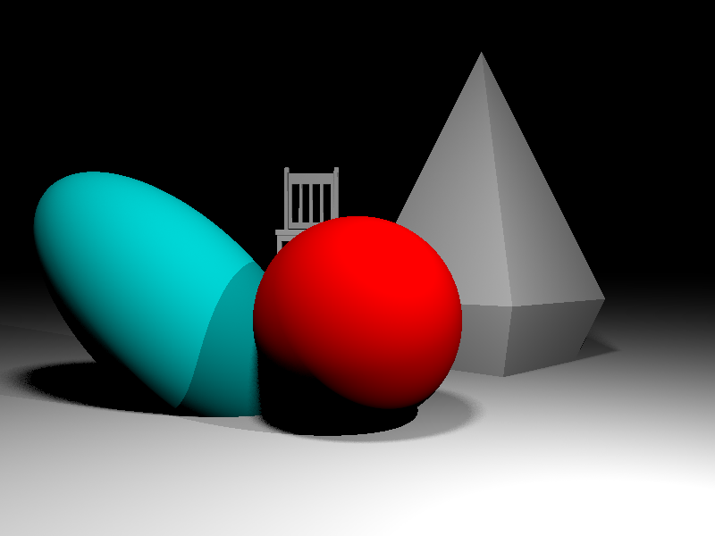

<h1>Runder 🐮</h1>
Runder (Short for Rust Render) is a ray tracing renderer made in rust.
It is just a hobby project and definitely not complete or usable.
Some of its features are .obj import for triangle meshes, soft shadows, acceleration using a BVH and conversion between rgb and xyz color spaces including multiple white references.

Here is an example:

